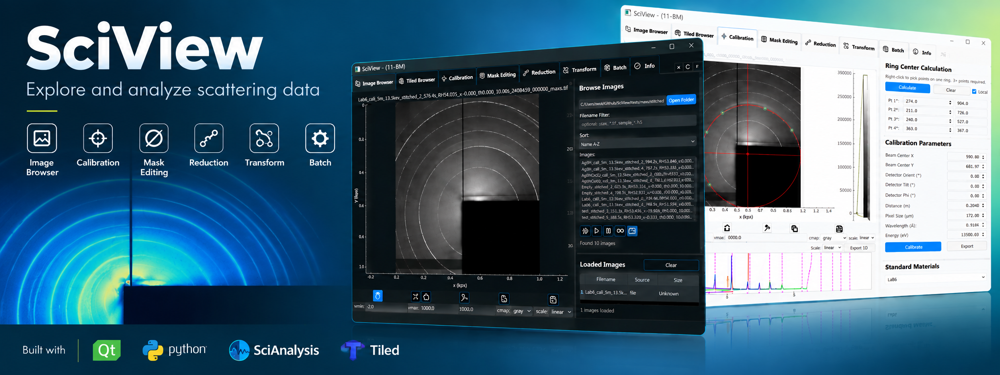

# SciView

*This AI-generated image is for demonstration only and may differ from the current application.*

SciView is a desktop application for working with 2D X-ray scattering data. It gives you a unified interface to open and inspect images, refine calibration, mask problem areas, preview analysis results, and process multiple files.

If you work with X-ray scattering data, SciView helps you move through these tasks in a connected workflow instead of switching between separate tools or writing scripts from scratch.

SciView uses [SciAnalysis](https://github.com/CFN-softbio/SciAnalysis) as its core processing engine for X-ray scattering data.

## What you can do in SciView

SciView is organized into tabs, each one helping with a part of the analysis flow:

- Image Browser: open and inspect local detector images
- Tiled Browser: load data from a configured [NSLS-II Tiled catalog](https://tiled.nsls2.bnl.gov/)
- Calibration: check and adjust beam center and detector geometry
- Mask Editing: hide bad regions such as gaps, beamstop shadows, and hot pixels
- Reduction: preview 1D reductions such as circular or sector averages
- Transform: preview reciprocal-space views such as qx-qz, qr-qz, and q-phi maps
- Batch: run selected SciAnalysis processing protocols on multiple local files
- Info: review the current image and metadata

The tabs are connected, so once you load an image, the app can carry that same image, calibration, and mask information across the workflow.

## Getting started

For most users, the easiest way to start is with the launcher script for your system.

### Windows

Double-click [Launch-SciView-win64.cmd](Launch-SciView-win64.cmd).

If Windows asks whether to install Pixi, choose Y to continue. If the launcher asks you to close it after installation, double-click it again.

### macOS and Linux

From the repository folder, use the launcher for your system:

- macOS: `./Launch-SciView-macOS.command`
- Linux: `./Launch-SciView-linux.sh`

The launcher will install Pixi if needed and prepare the SciView environment automatically. The first launch may take a little longer; later launches should be faster.

## A typical SciView workflow

A normal session usually follows this order:

1. Open an image or scan.
2. Check the image in the viewer and confirm the data look correct.
3. Go to Calibration and refine geometry or beam-center values if needed.
4. Use Mask Editing to exclude regions that should not contribute to the analysis.
5. Preview the result in Reduction or Transform.
6. If needed, send a set of files through Batch processing.
7. Save or export the calibration, mask, or reduced result when it is ready.

## For developers

### How the project is organized

SciView separates the user interface from the analysis logic. The tab files control what you see and interact with, while the modules under `src/sciview` handle data access, calibration, masking, reduction, transforms, and batch execution.

#### Application and shared session

- [main.py](main.py): starts the Qt application, creates the tabs, and shares the active image, file list, calibration, mask, recipes, and display settings between them
- [src/sciview/launchers.py](src/sciview/launchers.py): Python launch entry point used by the Pixi environment
- [src/sciview/settings/app_settings.py](src/sciview/settings/app_settings.py): application defaults and runtime configuration
- [src/sciview/profiles/cms_profile.py](src/sciview/profiles/cms_profile.py): CMS beamline profile, detector defaults, and calibration defaults

#### User interface

- [tabs/](tabs): the Image Browser, Tiled Browser, Calibration, Mask Editing, Reduction, Transform, Batch, and Info tabs
- [tabs/base_image_tab.py](tabs/base_image_tab.py): common image-viewing behavior shared by analysis tabs
- [src/sciview/interfaces/stable_qt/](src/sciview/interfaces/stable_qt): reusable viewers, drawing tools, widgets, and Qt utilities
- [src/sciview/interfaces/theme/app_style.py](src/sciview/interfaces/theme/app_style.py): visual theme, sizing, icons, and layout rules

#### Analysis and data flow

- [src/sciview/processing/](src/sciview/processing): reduction, transform, recipe, batch, and SciAnalysis integration logic
- [src/sciview/calibration/](src/sciview/calibration): calibration file handling and reference standards
- [src/sciview/masking/](src/sciview/masking): mask file handling and mask operations
- [src/sciview/sources/](src/sciview/sources): local filesystem and Tiled data access

#### Setup and documentation

- [scripts/](scripts): environment setup and platform launcher support

### If something is not working

- If the app does not start, close it and run the launcher for your system again.
- If a tab does not show the image you expected, return to the browser tab and select the file again before switching back.
- If you are using Tiled data, check the connection and login state.
- If a SciAnalysis-related step fails, restart SciView so the launcher can check the environment.
- For manual setup or deeper troubleshooting, use [scripts/bootstrap_env.sh](scripts/bootstrap_env.sh).
